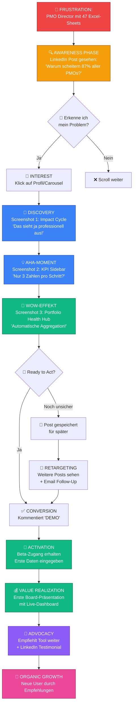

# 🎨 Visual Customer Journey - Infografik Design

## Mermaid Flowchart für LinkedIn Carousel



---

## 📐 Detailed Carousel Design (Für Canva/Figma)

### SLIDE 1: HOOK (Das Problem)
```
┏━━━━━━━━━━━━━━━━━━━━━━━━━━━━━━━━━━━━━━━━━━━━━┓
┃                                               ┃
┃               [Roter Hintergrund]             ┃
┃                                               ┃
┃           𝗪𝗔𝗥𝗨𝗠 𝗦𝗖𝗛𝗘𝗜𝗧𝗘𝗥𝗡                    ┃
┃         𝟴𝟳% 𝗔𝗟𝗟𝗘𝗥 𝗣𝗠𝗢𝘀                       ┃
┃      𝗜𝗡 𝗗𝗘𝗡 𝗘𝗥𝗦𝗧𝗘𝗡 𝟮 𝗝𝗔𝗛𝗥𝗘𝗡?                ┃
┃                                               ┃
┃        [Icon: 😤 Frustriertes Gesicht]        ┃
┃                                               ┃
┃         "Nicht wegen schlechter Arbeit"       ┃
┃          "Wegen mangelnder Sichtbarkeit"      ┃
┃                                               ┃
┃              Swipe für Lösung ➡️               ┃
┃                                               ┃
┃  [Logo unten rechts: PMO Impact Engine]       ┃
┗━━━━━━━━━━━━━━━━━━━━━━━━━━━━━━━━━━━━━━━━━━━━━┛

DESIGN-ELEMENTE:
• Font: Inter Black für Zahlen, Inter Bold für Text
• Größe: 87% in 120pt, Rest in 32pt
• Farbe: Weiß auf #ef4444 (Rot)
• Icon: Emoji oder Custom Illustration
• Accent: Gelber Pfeil für "Swipe"
```

---

### SLIDE 2: DAS PROBLEM (Pain Points)
```
┏━━━━━━━━━━━━━━━━━━━━━━━━━━━━━━━━━━━━━━━━━━━━━┓
┃                                               ┃
┃        [Dunkler Navy Hintergrund #0f172a]     ┃
┃                                               ┃
┃           𝗗𝗔𝗦 𝗨𝗡𝗦𝗜𝗖𝗛𝗧𝗕𝗔𝗥𝗘 𝗣𝗠𝗢             ┃
┃                                               ┃
┃  ┌──────────────────────────────────────┐    ┃
┃  │                                      │    ┃
┃  │  [Screenshot: Excel-Chaos]           │    ┃
┃  │  47 Tabs, niemand blickt durch       │    ┃
┃  │                                      │    ┃
┃  └──────────────────────────────────────┘    ┃
┃                                               ┃
┃  ❌ Manuelle Reports: 40 Std./Monat          ┃
┃  ❌ Veraltete Daten bei Präsentation         ┃
┃  ❌ C-Level versteht's nicht                 ┃
┃  ❌ Budget immer in Gefahr                   ┃
┃                                               ┃
┃         "Kennst du das auch?" 👇              ┃
┃                                               ┃
┗━━━━━━━━━━━━━━━━━━━━━━━━━━━━━━━━━━━━━━━━━━━━━┛

DESIGN-ELEMENTE:
• Mockup: Screenshot oder Illustration von Excel-Chaos
• Icons: Rote X-Marks vor jedem Pain Point
• Font: Inter Semi-Bold, 22pt
• Callout-Box: Zitat in kursiv, 18pt
```

---

### SLIDE 3: DIE LÖSUNG (Product Hero Shot)
```
┏━━━━━━━━━━━━━━━━━━━━━━━━━━━━━━━━━━━━━━━━━━━━━┓
┃                                               ┃
┃      𝗗𝗜𝗘 𝗟Ö𝗦𝗨𝗡𝗚: 𝗣𝗠𝗢 𝗜𝗠𝗣𝗔𝗖𝗧 𝗘𝗡𝗚𝗜𝗡𝗘      ┃
┃                                               ┃
┃  ┏━━━━━━━━━━━━━━━━━━━━━━━━━━━━━━━━━━━━━━┓   ┃
┃  ┃                                       ┃   ┃
┃  ┃   [FULL SCREENSHOT: Impact Cycle]     ┃   ┃
┃  ┃                                       ┃   ┃
┃  ┃   • 10 Milestones (kreisförmig)       ┃   ┃
┃  ┃   • Fortschrittsringe                 ┃   ┃
┃  ┃   • Portfolio Health Hub (Mitte)      ┃   ┃
┃  ┃   • Interaktiv & klickbar             ┃   ┃
┃  ┃                                       ┃   ┃
┃  ┗━━━━━━━━━━━━━━━━━━━━━━━━━━━━━━━━━━━━━━┛   ┃
┃                                               ┃
┃  ✅ Basiert auf PMI Best Practices            ┃
┃  ✅ Live-Daten statt Excel                    ┃
┃  ✅ Visuell verständlich                      ┃
┃                                               ┃
┗━━━━━━━━━━━━━━━━━━━━━━━━━━━━━━━━━━━━━━━━━━━━━┛

DESIGN-ELEMENTE:
• Hero Shot: Dein aktueller Screenshot (mit Dummy-Daten)
• Callouts: Nummerierte Pfeile (1-4) auf Key Features
• Grüne Checkmarks vor Benefits
• Subtle Drop-Shadow um Screenshot
```

---

### SLIDE 4: FEATURE #1 (KPI-Tracking)
```
┏━━━━━━━━━━━━━━━━━━━━━━━━━━━━━━━━━━━━━━━━━━━━━┓
┃                                               ┃
┃      𝗙𝗘𝗔𝗧𝗨𝗥𝗘 #𝟭: 𝗞𝗣𝗜-𝗧𝗥𝗔𝗖𝗞𝗜𝗡𝗚              ┃
┃                                               ┃
┃  ┌────────────────────────────────────────┐  ┃
┃  │  [Screenshot: Sidebar mit KPIs]        │  ┃
┃  │                                        │  ┃
┃  │  ☑ Strategic: Stakeholder Awareness   │  ┃
┃  │     Ziel: 85  |  Ist: 67  [▓▓▓▓░ 78%] │  ┃
┃  │                                        │  ┃
┃  │  ☑ Tactical: Interview Coverage       │  ┃
┃  │     Ziel: 100 |  Ist: 73  [▓▓▓▓░ 73%] │  ┃
┃  │                                        │  ┃
┃  │  ☑ Operational: Training Rate          │  ┃
┃  │     Ziel: 90  |  Ist: 88  [▓▓▓▓▓ 98%] │  ┃
┃  │                                        │  ┃
┃  └────────────────────────────────────────┘  ┃
┃                                               ┃
┃    💡 NUR 3 ZAHLEN PRO MILESTONE              ┃
┃    🔄 AUTOMATISCHE AGGREGATION                ┃
┃    📊 LIVE-BERECHNUNG                         ┃
┃                                               ┃
┗━━━━━━━━━━━━━━━━━━━━━━━━━━━━━━━━━━━━━━━━━━━━━┛

DESIGN-ELEMENTE:
• Screenshot mit Zoom auf KPI-Karten
• Farbige Progress Bars (Grün/Gelb/Rot)
• Icons für jeden Benefit
• Pulsing Animation Indicator (GIF möglich)
```

---

### SLIDE 5: FEATURE #2 (Portfolio Health Hub)
```
┏━━━━━━━━━━━━━━━━━━━━━━━━━━━━━━━━━━━━━━━━━━━━━┓
┃                                               ┃
┃    𝗙𝗘𝗔𝗧𝗨𝗥𝗘 #𝟮: 𝗣𝗢𝗥𝗧𝗙𝗢𝗟𝗜𝗢 𝗛𝗘𝗔𝗟𝗧𝗛 𝗛𝗨𝗕      ┃
┃                                               ┃
┃         IT-TRANSFORMATION 2026                ┃
┃                                               ┃
┃              ╭─────────╮                      ┃
┃            ╱   🟡🔵🟢   ╲                     ┃
┃          │               │                    ┃
┃          │      73%      │  ← TOTAL IMPACT    ┃
┃          │               │                    ┃
┃            ╲ IMPACT    ╱                      ┃
┃              ╰───────╯                        ┃
┃                                               ┃
┃        🟡 Strategic:    80%                   ┃
┃        🔵 Tactical:     50%                   ┃
┃        🟢 Operational:  90%                   ┃
┃                                               ┃
┃    ⚡ ECHTZEIT-AGGREGATION                    ┃
┃    🎯 C-LEVEL VERSTEHT ES IN 10 SEK.         ┃
┃    📤 EXPORT-READY FÜR BOARD-MEETINGS         ┃
┃                                               ┃
┗━━━━━━━━━━━━━━━━━━━━━━━━━━━━━━━━━━━━━━━━━━━━━┛

DESIGN-ELEMENTE:
• Zentrale Ringvisualisierung (groß)
• Drei farbige Balken unter den Ringen
• Animierte Füllung (wenn Video/GIF)
• Glühender Effekt bei >90%
```

---

### SLIDE 6: FEATURE #3 (Multi-Mode)
```
┏━━━━━━━━━━━━━━━━━━━━━━━━━━━━━━━━━━━━━━━━━━━━━┓
┃                                               ┃
┃     𝗙𝗘𝗔𝗧𝗨𝗥𝗘 #𝟯: 𝗠𝗨𝗟𝗧𝗜-𝗠𝗢𝗗𝗘 𝗦𝗬𝗦𝗧𝗘𝗠        ┃
┃                                               ┃
┃  ┌─────────────────┬─────────────────────┐   ┃
┃  │  NORMALO-MODUS  │   MANAGEMENT-MODUS  │   ┃
┃  ├─────────────────┼─────────────────────┤   ┃
┃  │                 │                     │   ┃
┃  │ "Wissensstand   │ "Stakeholder        │   ┃
┃  │  der Beteiligten"│  Awareness Index"  │   ┃
┃  │                 │                     │   ┃
┃  │ Einfache Sprache│ PMI-Nomenklatur     │   ┃
┃  │ Für Teams       │ Für C-Level         │   ┃
┃  │                 │                     │   ┃
┃  └─────────────────┴─────────────────────┘   ┃
┃                                               ┃
┃         🌍 3 SPRACHEN: DE | EN | ES           ┃
┃         👔 2 REGISTER: TEAM | MANAGEMENT      ┃
┃         🔄 SWITCH MIT EINEM KLICK             ┃
┃                                               ┃
┃    "𝗗𝗶𝗲 𝗴𝗹𝗲𝗶𝗰𝗵𝗲𝗻 𝗗𝗮𝘁𝗲𝗻,                      ┃
┃     𝘇𝘄𝗲𝗶 𝘃𝗲𝗿𝘀𝗰𝗵𝗶𝗲𝗱𝗲𝗻𝗲 𝗦𝗽𝗿𝗮𝗰𝗵𝗲𝗻."            ┃
┃                                               ┃
┗━━━━━━━━━━━━━━━━━━━━━━━━━━━━━━━━━━━━━━━━━━━━━┛

DESIGN-ELEMENTE:
• Split-Screen Vergleich
• Toggle-Switch Illustration
• Flaggen-Icons für Sprachen
• Zitat in anderer Schriftfarbe (Gold)
```

---

### SLIDE 7: SOCIAL PROOF (Testimonials)
```
┏━━━━━━━━━━━━━━━━━━━━━━━━━━━━━━━━━━━━━━━━━━━━━┓
┃                                               ┃
┃         𝗪𝗔𝗦 𝗕𝗘𝗧𝗔-𝗡𝗨𝗧𝗭𝗘𝗥 𝗦𝗔𝗚𝗘𝗡             ┃
┃                                               ┃
┃  ┌────────────────────────────────────────┐  ┃
┃  │ 👤 "Endlich kann ich dem CFO in        │  ┃
┃  │     30 Sekunden zeigen, wo wir stehen  │  ┃
┃  │     – ohne 3 Tage Präp-Zeit."          │  ┃
┃  │                                        │  ┃
┃  │  — Head of PMO, DAX-Konzern            │  ┃
┃  └────────────────────────────────────────┘  ┃
┃                                               ┃
┃  ┌────────────────────────────────────────┐  ┃
┃  │ 👤 "Mein Board hat das Tool nach       │  ┃
┃  │     5 Minuten verstanden. Jetzt wollen │  ┃
┃  │     sie es für alle Portfolios."       │  ┃
┃  │                                        │  ┃
┃  │  — Portfolio Director, Fortune 500     │  ┃
┃  └────────────────────────────────────────┘  ┃
┃                                               ┃
┃        ⭐⭐⭐⭐⭐ 4.9/5.0 (Beta)                  ┃
┃                                               ┃
┗━━━━━━━━━━━━━━━━━━━━━━━━━━━━━━━━━━━━━━━━━━━━━┛

DESIGN-ELEMENTE:
• Zitat-Boxen mit leichtem Schatten
• Avatar-Platzhalter oder Stock-Photos
• Sterne-Rating prominent
• Unterschiedliche Farben pro Testimonial
```

---

### SLIDE 8: BENEFITS ZUSAMMENFASSUNG
```
┏━━━━━━━━━━━━━━━━━━━━━━━━━━━━━━━━━━━━━━━━━━━━━┓
┃                                               ┃
┃           𝗗𝗘𝗜𝗡𝗘 𝗩𝗢𝗥𝗧𝗘𝗜𝗟𝗘                    ┃
┃                                               ┃
┃  ┏━━━━━━━━━━━━━━━━━━━━━━━━━━━━━━━━━━━━━┓    ┃
┃  ┃                                    ┃    ┃
┃  ┃  ⏰  90% weniger Zeit              ┃    ┃
┃  ┃      für Reports                  ┃    ┃
┃  ┃                                    ┃    ┃
┃  ┃  📊  100% Transparenz              ┃    ┃
┃  ┃      in Echtzeit                  ┃    ┃
┃  ┃                                    ┃    ┃
┃  ┃  💰  ROI-Nachweis                  ┃    ┃
┃  ┃      auf Knopfdruck               ┃    ┃
┃  ┃                                    ┃    ┃
┃  ┃  🎯  C-Level versteht es          ┃    ┃
┃  ┃      in 10 Sekunden               ┃    ┃
┃  ┃                                    ┃    ┃
┃  ┗━━━━━━━━━━━━━━━━━━━━━━━━━━━━━━━━━━━━━┛    ┃
┃                                               ┃
┃        Von Chaos zu Klarheit                  ┃
┃           in 2 Wochen                         ┃
┃                                               ┃
┗━━━━━━━━━━━━━━━━━━━━━━━━━━━━━━━━━━━━━━━━━━━━━┛

DESIGN-ELEMENTE:
• Große Icons vor jedem Benefit
• Zahlen fett hervorgehoben (90%, 100%)
• Grüne Akzentfarbe für positive Outcomes
• Zentrale Box mit Schatten
```

---

### SLIDE 9: CALL-TO-ACTION
```
┏━━━━━━━━━━━━━━━━━━━━━━━━━━━━━━━━━━━━━━━━━━━━━┓
┃                                               ┃
┃       [Gradient Hintergrund: Blau→Grün]       ┃
┃                                               ┃
┃          𝗕𝗘𝗥𝗘𝗜𝗧 𝗙Ü𝗥 𝗗𝗘𝗡 𝗪𝗔𝗡𝗗𝗘𝗟?             ┃
┃                                               ┃
┃         ┏━━━━━━━━━━━━━━━━━━━━┓                ┃
┃         ┃                    ┃                ┃
┃         ┃  Kommentiere "𝗗𝗘𝗠𝗢"┃                ┃
┃         ┃  für Beta-Zugang   ┃                ┃
┃         ┃                    ┃                ┃
┃         ┗━━━━━━━━━━━━━━━━━━━━┛                ┃
┃                                               ┃
┃            [QR-Code]                          ┃
┃       oder scanne für Details                ┃
┃                                               ┃
┃  ✅ Kostenlose 30-Tage-Trial                 ┃
┃  ✅ Persönliches Onboarding                  ┃
┃  ✅ Keine Kreditkarte nötig                  ┃
┃                                               ┃
┃  [Logo + Tagline]                             ┃
┃  PMO Impact Engine                            ┃
┃  "Because Value Deserves Visibility"         ┃
┃                                               ┃
┗━━━━━━━━━━━━━━━━━━━━━━━━━━━━━━━━━━━━━━━━━━━━━┛

DESIGN-ELEMENTE:
• Auffälliger Gradient-Hintergrund
• CTA in kontrastierender Box
• QR-Code prominent platziert
• Drei grüne Checkmarks für Sicherheit
• Logo mit Tagline am Ende
```

---

## 🎥 VIDEO STORYBOARD (60 Sekunden)

### FRAME 1-10: PROBLEM (0-10s)
```
┌─────────────────────────────────────┐
│  [Wide Shot: Büro, Person an Desk] │
│                                     │
│  Voiceover:                         │
│  "87% aller PMOs scheitern..."      │
│                                     │
│  [Zoom auf frustriertes Gesicht]    │
│                                     │
│  "...nicht wegen schlechter Arbeit" │
└─────────────────────────────────────┘

VISUALS:
• Dunkel beleuchtetes Büro
• Chaos auf dem Schreibtisch
• Multiple Bildschirme mit Excel
• Person hält Kopf in Händen
```

### FRAME 11-20: GRUND (10-20s)
```
┌─────────────────────────────────────┐
│  [Close-Up: Excel-Sheet]            │
│                                     │
│  Voiceover:                         │
│  "...sondern weil niemand           │
│   ihren Wert sieht."                │
│                                     │
│  [Report fliegt in Papierkorb]      │
│                                     │
│  [Fade to Black]                    │
└─────────────────────────────────────┘

VISUALS:
• Zoom auf unübersichtliches Excel
• Hand zerknüllt Papier-Report
• Wurf in Papierkorb (Slow-Motion)
• Schwarzer Screen mit Fragezeichen
```

### FRAME 21-35: LÖSUNG (20-35s)
```
┌─────────────────────────────────────┐
│  [Screen-Recording: Product]        │
│                                     │
│  Voiceover:                         │
│  "Deshalb haben wir den PMO         │
│   Impact & Value Engine entwickelt."│
│                                     │
│  [Quick Cuts:]                      │
│  • Impact Cycle (3s)                │
│  • KPI Sidebar (3s)                 │
│  • Portfolio Health Hub (3s)        │
│  • Multi-Mode Switch (3s)           │
└─────────────────────────────────────┘

VISUALS:
• Clean, moderne UI
• Smooth Transitions
• Highlights auf Key Features
• Mouse-Cursor zeigt Interaktivität
```

### FRAME 36-50: BENEFIT (35-50s)
```
┌─────────────────────────────────────┐
│  [Split-Screen]                     │
│                                     │
│  Links: Person präsentiert am Laptop│
│  Rechts: Begeistertes Board-Team    │
│                                     │
│  Voiceover:                         │
│  "90% weniger Zeit für Reporting"   │
│                                     │
│  [Applaus im Meeting-Raum]          │
│                                     │
│  "100% mehr Überzeugungskraft"      │
└─────────────────────────────────────┘

VISUALS:
• Lichtdurchfluteter Boardroom
• Zufriedene Gesichter
• Nicken, Thumbs-Up
• Handshake am Ende
```

### FRAME 51-60: CTA (50-60s)
```
┌─────────────────────────────────────┐
│  [Animated Logo]                    │
│                                     │
│  Text Einblendung:                  │
│  "Kommentiere DEMO für Beta-Zugang" │
│                                     │
│  [Website-URL erscheint]            │
│  www.pmo-impact-engine.com          │
│                                     │
│  Tagline:                           │
│  "Because Value Deserves Visibility"│
└─────────────────────────────────────┘

VISUALS:
• Logo mit Glow-Effekt
• Text-Animation (Typewriter)
• QR-Code in Ecke
• Social Media Icons
```

---

## 📊 ANALYTICS TRACKING SETUP

### UTM-Parameter für LinkedIn
```
https://pmo-impact-engine.com?
  utm_source=linkedin
  &utm_medium=social
  &utm_campaign=launch_carousel_jan2026
  &utm_content=slide_9_cta
```

### Conversion Goals
1. **Awareness**: Profile Views (+200%)
2. **Interest**: Carousel Swipe-Through Rate (>40%)
3. **Desire**: Comment "DEMO" (>50)
4. **Action**: Beta Sign-Up (>20)

### A/B Testing Variants
- **Post-Text**: Variante 1 (Problem-Story) vs. Variante 2 (Thought Leadership)
- **CTA**: "Kommentiere DEMO" vs. "Link in Bio"
- **Visuals**: Screenshot vs. Illustration

---

## ✅ FINAL CHECKLIST

### Content Creation
- [ ] 2 LinkedIn Post-Texte geschrieben
- [ ] 9 Carousel-Slides designed (Canva/Figma)
- [ ] 60s Product Video gedreht
- [ ] Testimonials eingeholt (min. 2)
- [ ] Screenshots mit Dummy-Daten vorbereitet

### Technical Setup
- [ ] Landing Page mit CTA Form
- [ ] UTM-Links erstellt
- [ ] Email-Autoresponder (für "DEMO" Comments)
- [ ] Analytics-Tracking aktiviert
- [ ] QR-Code generiert

### Pre-Launch
- [ ] LinkedIn Profil optimiert
- [ ] Company Page aktualisiert
- [ ] 3 "Warm-Up" Posts veröffentlicht (Woche vor Launch)
- [ ] Connections angeschrieben (Personal Network)
- [ ] Industry Hashtags recherchiert

### Post-Launch
- [ ] Auf alle Kommentare antworten (1. Stunde!)
- [ ] DMs mit Demo-Link versenden
- [ ] Engagement tracken (Analytics)
- [ ] Follow-Up Posts planen (Tag 2, 4, 7)

---

**Nächster Schritt**: Sollen wir die Carousel-Grafiken jetzt in Canva/Figma umsetzen oder zuerst den Post-Text final machen?

